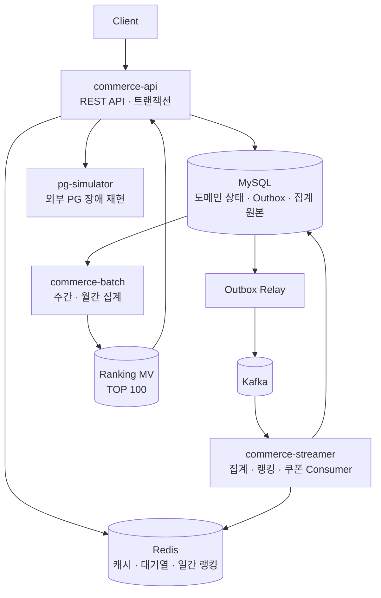

# E-Commerce Backend Platform

> Kotlin과 Spring으로 구축한 이벤트 기반 이커머스 백엔드입니다.
> 주문·결제의 정합성부터 트래픽 제어, 실시간·배치 랭킹까지 운영 환경에서 발생할 문제를 작은 규모로 재현하고 해결했습니다.

`개인 프로젝트` · `10주` · `요구사항 분석 / 설계 / 구현 / 테스트 / 성능 측정 전 과정 단독 수행`

## 한눈에 보는 결과

| 문제 | 결과 | 검증 방법 |
|---|---|---|
| 30만 건 상품 조회의 풀스캔·정렬 | 최신순 **118ms → 0.065ms**, 인기순 **99ms → 0.028ms** | MySQL `EXPLAIN ANALYZE` |
| 목록 조회마다 발생하는 `COUNT(*)` | Redis 적중 시 **약 49ms → 0.1ms** | `redis-benchmark`, 데이터 계층 비교 |
| 인기 상품에 집중되는 주문 트래픽 | 한계 **약 150 TPS**를 측정하고 안전 처리량을 **80 TPS**로 설정 | k6 부하 테스트 |
| DB 커밋과 Kafka 발행 사이의 유실 | Transactional Outbox와 재발행으로 **At-least-once 발행** 보장 | 통합 테스트 |
| Kafka 재전달에 따른 중복 집계 | RDB 멱등 표식과 Redis Lua 원자 실행으로 **처리 결과를 1회로 수렴** | 중복 이벤트 재처리 테스트 |
| Redis 랭킹 유실과 배치 중단 | RDB 원본 기반 원자 복구, 완료 스텝을 보존하는 재시작 경로 구성 | Testcontainers 잡 관통·재시작 테스트 |

> 성능 수치는 Docker 기반 로컬 환경의 데이터 계층 측정값입니다. 절대 성능보다 병목을 찾고 설계값을 결정한 근거로 사용했습니다. 자세한 조건은 [읽기 성능 측정 기록](./.docs/week5/benchmark.md)과 [주문 대기열 설계](https://github.com/loopers-labs/loop-pack-be-l2-vol4-kotlin/issues/114)에 남겼습니다.

## 프로젝트 범위

- 회원, 브랜드, 상품, 좋아요
- 주문, 쿠폰, 외부 PG 결제와 정산
- Redis 기반 주문 대기열과 입장 토큰
- Kafka 기반 상품 지표 집계와 선착순 쿠폰 발급
- Redis 일간 실시간 랭킹
- Spring Batch 주간·월간 랭킹과 Materialized View

단순히 기능을 연결하는 데서 끝내지 않고 다음 질문에 답하는 것을 목표로 삼았습니다.

- 동시에 요청이 들어와도 재고·쿠폰·결제 상태가 맞는가?
- 외부 PG나 Redis가 느리거나 실패해도 핵심 기능이 통제 가능한 상태로 남는가?
- DB 커밋 이후 Kafka 발행이 실패하거나 메시지가 중복 전달되면 어떻게 복구하는가?
- 대기열 허용량과 캐시 도입을 추정이 아닌 측정값으로 설명할 수 있는가?
- 실시간 조회와 장기 집계를 하나의 저장 방식으로 해결하지 않아야 하는 이유는 무엇인가?

## 시스템 아키텍처



| 애플리케이션 | 책임 |
|---|---|
| `commerce-api` | 주문·결제·상품·랭킹 API, 트랜잭션 경계, Outbox 저장 |
| `commerce-streamer` | Kafka 이벤트 소비, 상품 지표·실시간 랭킹·쿠폰 발급 처리 |
| `commerce-batch` | 시간별 원본을 주간·월간으로 집계하고 TOP 100 MV 교체 |
| `pg-simulator` | 접수 지연, 처리 지연, 실패와 콜백을 재현하는 외부 PG 시뮬레이터 |

실행 앱끼리는 직접 의존하지 않습니다. DB 스키마, Kafka 토픽, Redis 키처럼 컴파일러가 확인할 수 없는 계약은 설계 문서와 양쪽 테스트로 고정했습니다.

## 핵심 문제 해결

### 1. 동시성 제어와 외부 결제 상태 수렴

주문은 여러 상품의 재고와 쿠폰을 한 번에 변경하고, 결제는 신뢰할 수 없는 외부 PG와 통신합니다. 모든 자원에 같은 잠금 전략을 적용하지 않고 실패 비용과 경합 지점에 맞춰 선택했습니다.

| 자원 | 선택 | 보호하는 불변식 |
|---|---|---|
| 재고 | 상품 ID 정렬 조회 + 비관적 쓰기 락 | 음수 재고 방지, 다건 잠금 순서 고정 |
| 쿠폰 | 사용자 쿠폰 비관적 쓰기 락 | 한 쿠폰의 중복 사용 방지 |
| 주문 | `Idempotency-Key` 조회 | 네트워크 재시도에 따른 중복 주문 방지 |
| 결제 정산 | 거래 식별자 기준 비관적 락 | 콜백과 폴링이 동시에 도착해도 한 번만 상태 전이 |

PG 호출은 `CircuitBreaker(Retry(call))` 순서로 감쌌습니다. 재시도 전체를 사용자 요청 한 건으로 집계하고, 회로가 열리면 Retry에 들어가기 전에 차단합니다. 일시 장애가 나면 결제를 `REQUESTED`로 유지하고 Callback을 주 경로, Polling을 보조 경로로 사용해 최종 상태를 `APPROVED` 또는 `FAILED`로 수렴시킵니다.

- 연결·읽기 타임아웃: 1초 / 2초
- Retry: 최대 3회, 지수 Backoff와 ±50% Jitter
- CircuitBreaker: 전송 실패만 집계해 4xx나 애플리케이션 오류로 회로가 열리지 않도록 제한
- 트레이드오프: 재시도가 포함된 요청 전체 시간이 Slow Call로 집계됩니다. 원격 서버의 단일 호출 성능보다 사용자가 경험한 지연과 시스템 자원 보호를 우선한 결정입니다.

상세 결정: [결제 회복 전략 설계](./docs/domain/payment/resilience-design-doc.md) · [ADR](./docs/domain/payment/resilience-decisions.md)

### 2. 30만 건 상품 조회 병목을 측정하고 제거

초기 상품 목록은 `PRIMARY KEY` 외 인덱스가 없어 `LIMIT 20` 요청도 약 30만 행을 모두 읽고 정렬했습니다. 쿼리 패턴을 전역 조회와 브랜드 필터 조회로 나누고, 필터·정렬·동점 기준을 함께 만족하는 복합 인덱스 6개를 설계했습니다.

| 시나리오 | 개선 전 | 개선 후 | 변화 |
|---|---:|---:|---:|
| 최신순 첫 페이지 | 118ms | 0.065ms | 약 1,800배 |
| 인기순 첫 페이지 | 99ms | 0.028ms | 약 3,500배 |
| 브랜드별 가격순 | 69ms | 0.11ms | 약 600배 |
| 브랜드별 인기순 | 69ms | 0.089ms | 약 770배 |

인덱스 적용 뒤에는 목록 데이터보다 Spring Data `Page`의 `COUNT(*)`가 약 49ms로 병목이 됐습니다. 첫 5페이지에 Cache-Aside를 적용해 Redis 적중 시 목록과 count를 함께 생략했습니다. Redis 장애는 cache miss로 취급해 DB로 폴백하고, 사용자별 `likedByMe`는 공유 캐시에서 제외해 키 증가와 정보 혼입을 막았습니다.

다만 10만 번째 offset은 인덱스를 적용해도 120ms가 걸립니다. 버릴 10만 행을 계속 읽어야 하기 때문에 커서 기반 페이지네이션을 후속 과제로 남겼습니다.

상세 기록: [읽기 성능 Before/After](./.docs/week5/benchmark.md) · [캐시 설계 보고서](./.docs/week5/cache-design-report.md)

### 3. 이벤트 경계와 전달 신뢰성 설계

모든 후속 작업을 Kafka로 보내면 내부 로직까지 브로커에 의존하고, 모두 동기로 처리하면 부가 작업의 실패와 지연이 핵심 요청에 전파됩니다. 처리 위치보다 실패가 원 요청을 실패시켜야 하는지를 기준으로 경계를 나눴습니다.

| 구분 | 선택 | 적용 예시 |
|---|---|---|
| 원 요청의 성공을 결정 | 동기 트랜잭션 | 주문 저장, 재고 차감, 쿠폰 사용 |
| 같은 JVM의 커밋 후 부가 작업 | `ApplicationEvent` + `AFTER_COMMIT` | 로깅, 내부 후속 처리 |
| 시스템 경계를 넘는 전달 | Kafka + Transactional Outbox | 판매 집계, 랭킹, 쿠폰 발급 |

도메인 상태와 Outbox 이벤트를 같은 DB 트랜잭션에 저장하고 Relay가 `PENDING` 이벤트를 Kafka로 보냅니다. 발행 실패는 재시도하고, 중복 전달은 Consumer가 `event_handled(event_id)`를 처리 결과와 같은 트랜잭션에 기록해 흡수합니다. 메시지는 한 번만 전달된다고 가정하지 않고, 여러 번 전달돼도 결과가 한 번만 반영되도록 만들었습니다.

선착순 쿠폰도 이 흐름에 포함했습니다. API는 요청을 접수하고, Consumer가 `remaining_quantity > 0` 조건부 차감과 `couponId + userId` 유니크 제약으로 수량 초과와 중복 발급을 막습니다.

[이벤트 경계·Outbox·멱등 소비 설계 자세히 보기 ↗](https://github.com/loopers-labs/loop-pack-be-l2-vol4-kotlin/issues/105)

### 4. Redis 주문 대기열의 처리량을 실측값으로 결정

주문 API 앞에 Redis Sorted Set 대기열을 두고, 입장 토큰을 받은 사용자만 주문을 실행하도록 제한했습니다. `ZADD NX`로 새로고침에도 기존 순번을 유지하고, `ZRANK`로 순번을 계산하며, 토큰 TTL로 입장 후 이탈한 사용자의 점유를 회수합니다.

처음에는 DB 커넥션 풀과 평균 응답시간만으로 175 TPS를 추정했지만, 인기 상품에서는 `FOR UPDATE` row lock이 요청을 직렬화한다는 점을 반영하지 못했습니다. k6로 트래픽 형태를 나눠 다시 측정했습니다.

| 부하 형태 | 측정 한계 | 병목 |
|---|---:|---|
| 여러 상품에 주문 분산 | 약 550 TPS | DB 커넥션 풀 |
| 단일 인기 상품에 집중 | 약 150 TPS | 상품 row lock + 커넥션 점유 |

행사 트래픽은 인기 상품에 집중된다는 전제로 `150 × 안전 마진 70% ÷ 재시도 비용 1.3 ≈ 80 TPS`를 기본 허용량으로 정했습니다. 스케줄러는 100ms마다 8명에게 토큰을 발급합니다. 예상 대기 시간과 권장 polling 주기도 서버가 계산해 클라이언트의 과도한 조회를 줄였습니다.

트레이드오프도 명시했습니다. 현재 대기열은 Redis 장애 시 주문 진입을 차단하는 fail-closed 성격이며, 운영 전에는 503 응답 정책과 Redis 고가용성 구성이 추가로 필요합니다.

[대기열 자료구조·토큰·처리량 산정 자세히 보기 ↗](https://github.com/loopers-labs/loop-pack-be-l2-vol4-kotlin/issues/114)

### 5. 실시간과 배치 랭킹을 서로 다른 저장 모델로 설계

시간 범위가 다른 랭킹을 한 저장소로 해결하지 않았습니다. 일간 랭킹은 최신성이 중요해 Redis ZSET으로 즉시 반영하고, 주간·월간 랭킹은 정확성과 반복 집계 비용이 중요해 Spring Batch와 조회 전용 MV를 사용했습니다.

#### 일간 실시간 랭킹

- 조회·좋아요·결제 완료 이벤트를 랭킹 전용 Consumer Group이 독립적으로 소비
- `rank:all:{yyyyMMdd}` ZSET에 이벤트별 가중 점수 누적, 48시간 TTL 적용
- `ZINCRBY`와 멱등 표식 저장을 Lua 하나로 원자 실행해 Kafka 재전달 중복 방지
- 자정 직전 전일 점수의 10%를 다음 날로 이월해 콜드 스타트 완화
- Redis는 조회용 데이터로 한정하고, `product_metrics_hourly`를 복구 가능한 원본으로 유지
- 랭킹 유실 시 임시 ZSET을 완성한 뒤 `RENAME`해 불완전한 복구 결과 노출 방지

[실시간 랭킹·Lua 멱등·유실 복구 자세히 보기 ↗](https://github.com/loopers-labs/loop-pack-be-l2-vol4-kotlin/issues/133)

#### 주간·월간 배치 랭킹

- 시간별 원본을 ISO 주·달력 월 단위로 Chunk 집계하고 TOP 100 MV 생성
- 기간 집계에는 점수가 아닌 조회·좋아요·주문 신호 개수를 저장해 가중치 변경 시 재사용
- `Clean → Aggregate → Rank`를 주간·월간 각각 3개 스텝으로 분리
- 기간 키 단위 `delete + insert`로 정정 재실행 결과를 멱등하게 유지
- MV는 한 트랜잭션에서 교체해 조회가 비어 있거나 일부만 갱신된 상태를 보지 않도록 처리
- 실패 후 재시작하면 완료한 Clean·Aggregate는 건너뛰고 실패 지점부터 재개

[Spring Batch 집계·재실행·재시작 자세히 보기 ↗](https://github.com/loopers-labs/loop-pack-be-l2-vol4-kotlin/issues/142)

## 10주간 핵심 문제 해결

기능을 순서대로 쌓는 데 그치지 않고, 매주 이전 단계에서 드러난 한계를 다음 설계 과제로 이어갔습니다.

| 주차 | 주제 | 핵심 문제와 해결 | 구현 기록 |
|---|---|---|---|
| 01 | 테스트 가능한 구조와 TDD | 회원 도메인을 Red → Green → Refactor로 구현하고, 도메인 모델과 JPA Entity를 분리해 순수한 비즈니스 규칙을 유지 | [PR #8 ↗](https://github.com/loopers-labs/loop-pack-be-l2-vol4-kotlin/pull/8) |
| 02 | 도메인 모델링과 설계 | 주문·결제·재고·쿠폰의 협력 관계를 분석하고, 트랜잭션 경계와 실패 시 상태 전이·보상 흐름을 문서화 | [PR #19 ↗](https://github.com/loopers-labs/loop-pack-be-l2-vol4-kotlin/pull/19) |
| 03 | 핵심 유스케이스 구현 | 브랜드·상품·좋아요·주문 기능을 4계층에 배치하고, 저장소 접근은 Facade가 조율하며 도메인 로직은 인프라에서 분리 | [PR #33 ↗](https://github.com/loopers-labs/loop-pack-be-l2-vol4-kotlin/pull/33) |
| 04 | 트랜잭션과 동시성 제어 | 재고·쿠폰·주문은 비관적 락, 좋아요 수는 조건부 원자 갱신을 적용해 자원의 경합 특성에 맞게 정합성을 보호 | [PR #54 ↗](https://github.com/loopers-labs/loop-pack-be-l2-vol4-kotlin/pull/54) |
| 05 | 읽기 성능 최적화 | 30만 건 데이터의 실행 계획을 측정하고 복합 인덱스·비정규화·Redis 캐시를 적용해 풀스캔과 반복 count 부하를 제거 | [PR #67 ↗](https://github.com/loopers-labs/loop-pack-be-l2-vol4-kotlin/pull/67) |
| 06 | 외부 PG 연동과 회복탄력성 | Timeout·Retry·CircuitBreaker로 외부 장애를 격리하고, Callback과 Polling이 같은 정산 경로로 최종 상태를 수렴하도록 설계 | [PR #90 ↗](https://github.com/loopers-labs/loop-pack-be-l2-vol4-kotlin/pull/90) |
| 07 | 이벤트 기반 아키텍처 | 동기 트랜잭션과 후속 처리를 분리하고, Transactional Outbox와 Consumer 멱등 처리로 Kafka 발행 유실·중복에 대응 | [PR #104 ↗](https://github.com/loopers-labs/loop-pack-be-l2-vol4-kotlin/pull/104) |
| 08 | Redis 주문 대기열 | 인기 상품 부하에서 확인한 150 TPS 한계를 기준으로 입장량을 80 TPS로 제어하고, 순번·입장 토큰·예상 대기 시간을 제공 | [PR #113 ↗](https://github.com/loopers-labs/loop-pack-be-l2-vol4-kotlin/pull/113) |
| 09 | 실시간 상품 랭킹 | Kafka 이벤트를 Redis ZSET에 원자·멱등 반영하고, 콜드 스타트 이월과 RDB 원본 기반 유실 복구 경로를 구성 | [PR #132 ↗](https://github.com/loopers-labs/loop-pack-be-l2-vol4-kotlin/pull/132) |
| 10 | 배치 랭킹 집계 | 시간별 원본을 주간·월간으로 Chunk 집계하고, 멱등 재실행·실패 스텝 재시작·MV 원자 교체를 구현 | [PR #141 ↗](https://github.com/loopers-labs/loop-pack-be-l2-vol4-kotlin/pull/141) |

## 아키텍처 원칙

```text
interfaces.api  →  application(Facade · outbound port)  ←  infrastructure
                              │
                              ▼
                   domain (순수 Kotlin)
```

- `Facade`가 유스케이스 조율, Repository 호출, 트랜잭션 경계를 소유합니다.
- 도메인은 Spring과 JPA를 참조하지 않고 규칙을 행위 메서드로 캡슐화합니다.
- 외부 PG, 캐시, 이벤트 발행처럼 교체되거나 실패할 수 있는 의존성에 outbound port를 둡니다.
- usecase와 1:1인 inbound interface는 코드량 대비 이점이 작다고 판단해 두지 않았습니다.
- `apps/*`는 서로 직접 의존하지 않고, `modules/*`의 JPA·Redis·Kafka 설정과 Testcontainers fixture만 재사용합니다.

자세한 모듈 위계와 의존 방향은 [아키텍처 문서](./docs/architecture.md)에서 확인할 수 있습니다.

## 테스트 전략

- **TDD + Tidy First**: Red → Green → Refactor를 따르고 구조 변경과 행위 변경을 분리합니다.
- **도메인 단위 테스트**: 상태 전이, 금액 계산, 기간 키, 랭킹 가중치 같은 순수 규칙을 빠르게 검증합니다.
- **어댑터 통합 테스트**: MySQL·Redis·Kafka Testcontainers로 락, 유니크 제약, Lua, 직렬화, 재전달을 검증합니다.
- **API E2E**: 인증, 요청 검증, 트랜잭션과 응답 계약을 실제 Spring Context에서 확인합니다.
- **잡 관통·재시작 테스트**: 시간별 원본부터 집계·MV까지 통과시키고 실패한 스텝부터 재개되는지 검증합니다.
- **부하 테스트**: k6와 `EXPLAIN ANALYZE`로 병목과 운영 설정의 근거를 남깁니다.

```bash
./gradlew ktlintCheck test
```

## 기술 스택

| 분류 | 기술 |
|---|---|
| Language | Kotlin 2.0.20, Java 21 |
| Framework | Spring Boot 3.4.4, Spring Batch, Spring Data JPA, QueryDSL |
| Storage | MySQL 8, Redis 7 master/readonly |
| Messaging | Kafka 3.5 KRaft, Transactional Outbox |
| Resilience | Resilience4j Retry, CircuitBreaker |
| Test | JUnit 5, Testcontainers, springmockk, k6 |
| Observability | Spring Actuator, Prometheus, Grafana |
| Build | Gradle Kotlin DSL, ktlint, Jacoco |

## 실행 방법

### 1. 로컬 인프라 실행

```bash
make init
docker-compose -f ./docker/infra-compose.yml up
```

### 2. 애플리케이션 실행

```bash
# REST API
./gradlew :apps:commerce-api:bootRun

# Kafka Consumer
./gradlew :apps:commerce-streamer:bootRun

# 주간·월간 랭킹 일괄 집계
./gradlew :apps:commerce-batch:bootRun \
  --args="--job.name=productRankJob targetDate=2026-07-22"
```

### 3. 모니터링 실행

```bash
docker-compose -f ./docker/monitoring-compose.yml up
# Grafana: http://localhost:3000
```

## 상세 기록

| 문서 | 내용 |
|---|---|
| [이벤트 경계 설계 ↗](https://github.com/loopers-labs/loop-pack-be-l2-vol4-kotlin/issues/105) | ApplicationEvent와 Kafka의 경계, Outbox, Consumer 멱등성 |
| [Redis 주문 대기열 ↗](https://github.com/loopers-labs/loop-pack-be-l2-vol4-kotlin/issues/114) | 자료구조, 입장 토큰, 처리량 측정과 설정값 산정 |
| [실시간 상품 랭킹 ↗](https://github.com/loopers-labs/loop-pack-be-l2-vol4-kotlin/issues/133) | Redis ZSET, Lua 원자 멱등, 콜드 스타트, 유실 복구 |
| [배치 랭킹 집계 ↗](https://github.com/loopers-labs/loop-pack-be-l2-vol4-kotlin/issues/142) | Chunk 집계, MV, 멱등 재실행, 실패 스텝 재시작 |
| [도메인 문서](./docs/domain) | 요구사항, API 명세, 테스트 계획과 설계 결정 |
| [주차별 기록](./.docs) | 목표, 구현 계획, 부하 테스트와 회고 |

## 의도적으로 남긴 개선 과제

- 10만 번째 offset 조회를 커서 기반 페이지네이션으로 전환
- Outbox·Consumer DLQ, 보관 주기, 운영자 재처리 도구 구성
- 주문 대기열의 Redis 장애 정책과 고가용성 구성 검증
- 배치 외부 스케줄러, 실패 알림, 실행 지연 모니터링 연결
- 실제 배포 환경에서 PG 회복 임계값과 대기열 처리량 재측정
